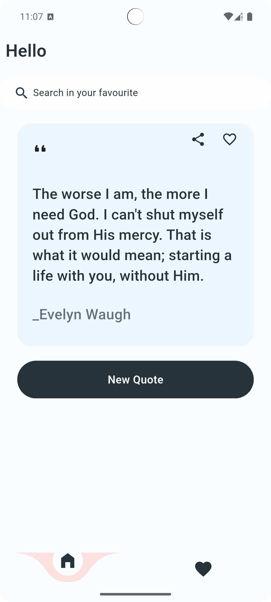
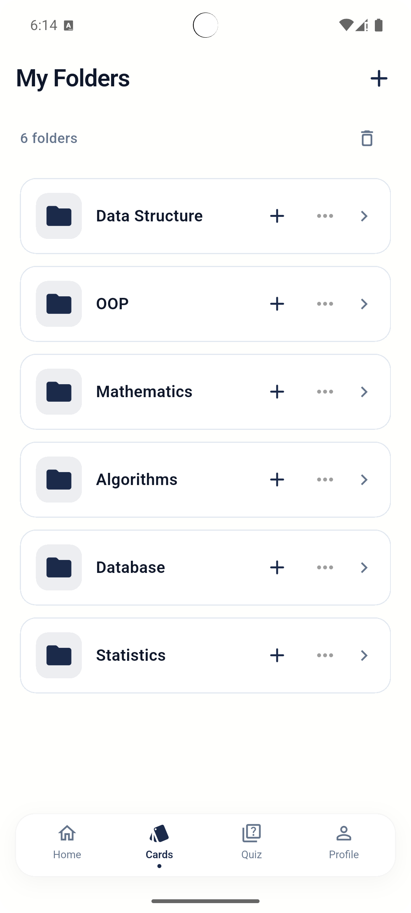
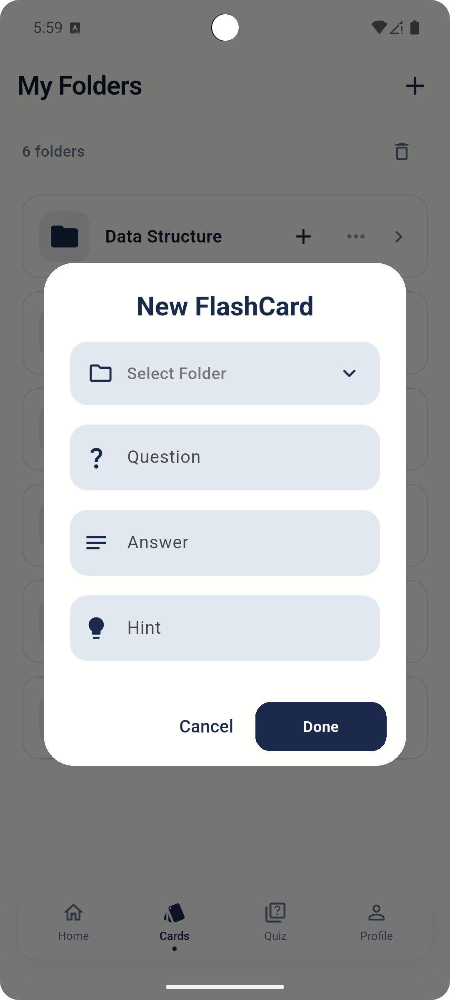
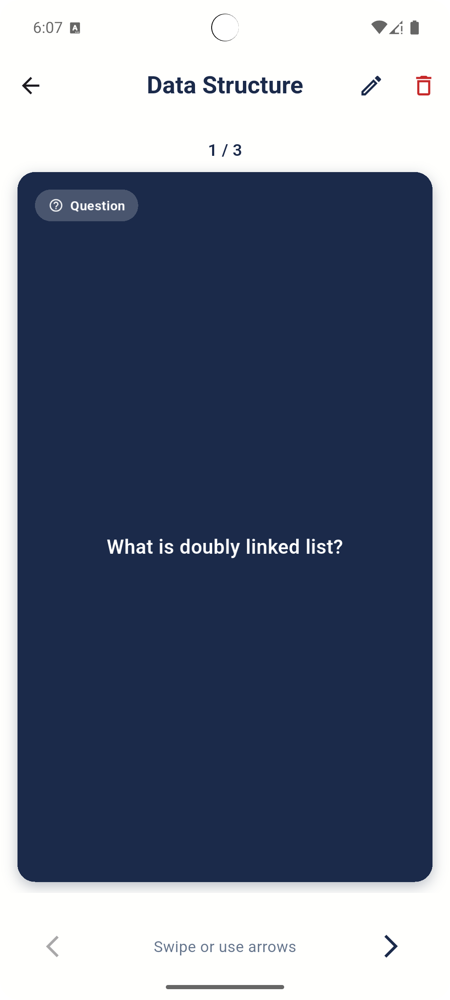
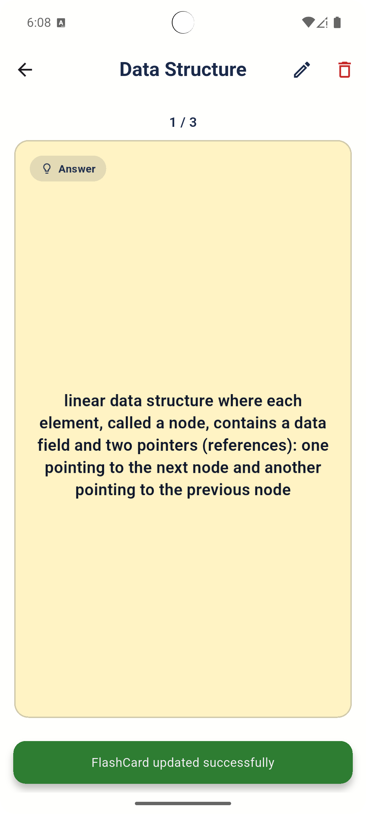
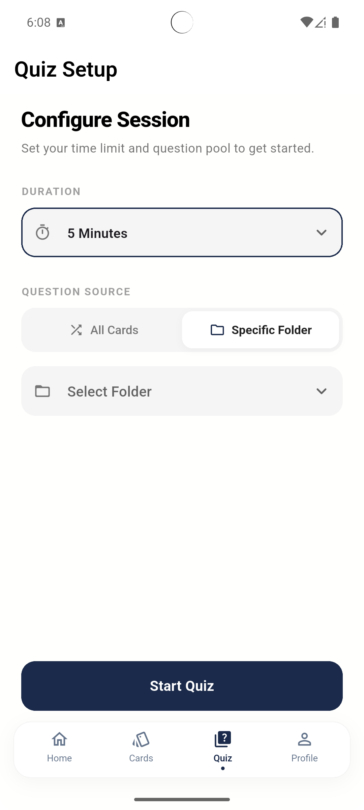
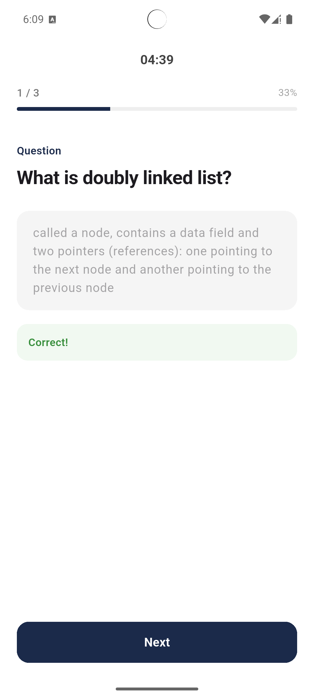
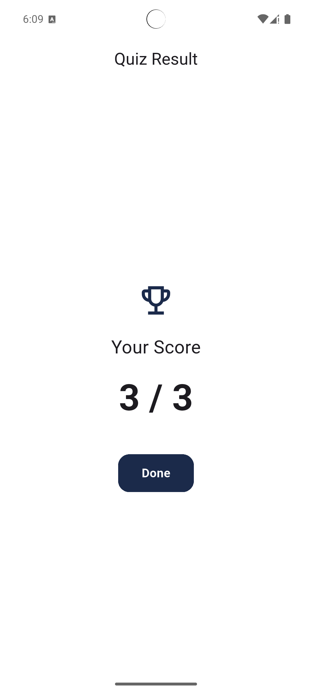
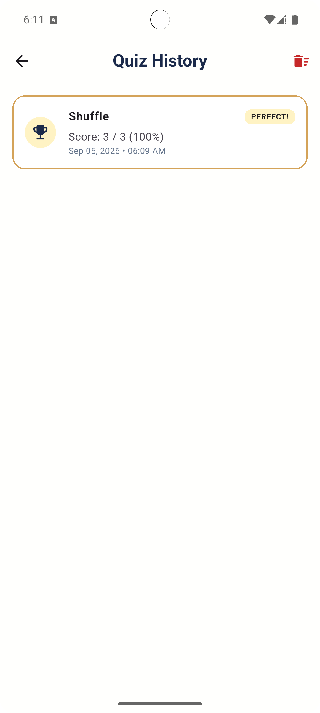
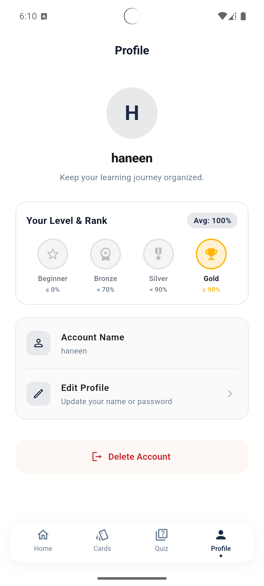

# 📚 Flash Cards

<p align="center">
  <strong>A modern Flutter application for creating, organizing, studying, and testing flashcards.</strong>
</p>

<p align="center">
  Organize your knowledge into folders, review flashcards with an interactive front/back experience,  
  create quizzes, track your results, and manage your learning progress.
</p>

<p align="center">
  
  
  
  
  
</p>

<p align="center">
  
  
  
  
  
</p>

<p align="center">
  
  
  
  
</p>

---

## ✨ Features

### 🗂️ Folder Management
- Create study folders for different subjects or topics.
- Add flashcards directly to a specific folder.
- Edit existing folders.
- Delete folders.
- Keep learning content organized and easy to access.

### 📝 Flashcard Management
Each flashcard contains:

- **Question**
- **Answer**
- **Hint**
- **Folder ID**

Users can create flashcards and associate them with their appropriate study folder.

### 🃏 Interactive Flashcards

Flashcards use a front/back study experience:

```text
        ┌──────────────────┐
        │     Question     │
        │                  │
        │       ↓          │
        │      Flip        │
        │       ↓          │
        │      Answer      │
        └──────────────────┘
```

Animations are used to make the learning experience more interactive and engaging.

### 🧠 Quiz System

The application provides a complete quiz flow:

- Select a folder.
- Configure the quiz.
- Answer questions.
- Calculate the final score.
- Display quiz results.
- Store previous quiz results in quiz history.

### 📊 Quiz History

Users can access previous quiz attempts and review their results.

### 👤 Profile

A dedicated profile screen provides access to user-related information and application options.

---

# 🎨 UI Preview

The application follows a clean and minimal interface designed around a simple learning workflow.

### 🏠 Home

Main entry point of the application where users can access their learning content and navigate through the main features.

<p align="center">
  
</p>

### 📁 Folders

Folders organize flashcards by subject, course, or topic.

<p align="center">
  
</p>

### ➕ Add Flashcard

Users can create a flashcard by entering its question, answer, hint, and selecting the folder where it belongs.

<p align="center">
  
</p>

### 🃏 Flashcard Experience

The flashcard is divided into a question/front side and an answer/back side.

<p align="center">
  
  &nbsp;&nbsp;&nbsp;
  
</p>

### ⚙️ Quiz Setup

Users configure their quiz before starting.

<p align="center">
  
</p>

### ❓ Quiz Questions

Questions are presented interactively during the quiz.

<p align="center">
  
</p>

### 🏆 Quiz Score

The final result is displayed after completing the quiz.

<p align="center">
  
</p>

### 📊 Quiz History

Users can review previous quiz attempts and results.

<p align="center">
  
</p>

### 👤 Profile

The profile screen contains user-related information and options.

<p align="center">
  
</p>

---

# 🛠️ Tech Stack

| Technology | Purpose |
|------------|---------|
| **Flutter** | Cross-platform application development |
| **Dart** | Application programming language |
| **BLoC** | Event-driven state management |
| **Cubit** | Lightweight state management |
| **Hive** | Local database and structured data persistence |
| **SharedPreferences** | Lightweight local data persistence |
| **Material UI** | UI components and application styling |
| **Animations** | Interactive and smooth user experience |
| **Firebase / Google Services** | Project service configuration |

---

# 🏗️ Project Architecture

The project follows a feature-based Flutter structure, keeping UI, state management, models, and shared resources separated.

```text
lib/
│
├── bloc/
│   ├── flash_cards_bloc.dart
│   ├── flash_cards_event.dart
│   ├── flash_cards_state.dart
│   └── ...
│
├── core/
│   ├── colors.dart
│   └── ...
│
├── models/
│   ├── flash_card_model.dart
│   ├── folder_model.dart
│   └── ...
│
├── features/
│   │
│   ├── cards/
│   │   ├── screens/
│   │   └── widgets/
│   │
│   ├── folders/
│   │   ├── screens/
│   │   └── widgets/
│   │
│   ├── quiz/
│   │   ├── screens/
│   │   └── widgets/
│   │
│   └── profile/
│
└── main.dart
```

The structure helps keep responsibilities separated and makes the application easier to maintain and extend.

---

# 🔄 Application Flow

```text
                         ┌─────────────┐
                         │    HOME     │
                         └──────┬──────┘
                                │
              ┌─────────────────┼─────────────────┐
              │                 │                 │
              ▼                 ▼                 ▼
          FOLDERS              QUIZ            PROFILE
              │                 │
              ▼                 ▼
       ADD FLASHCARD        QUIZ SETUP
              │                 │
              ▼                 ▼
      FLASHCARD FRONT       QUESTIONS
              │                 │
              ▼                 ▼
      FLASHCARD BACK        QUIZ SCORE
                                │
                                ▼
                         QUIZ HISTORY
```

---

# 🔄 State Management

The project uses both **BLoC** and **Cubit**, depending on the complexity of each feature.

## BLoC

BLoC is used for event-driven application flows.

The general flow is:

```text
User Action
     ↓
   Event
     ↓
    BLoC
     ↓
Business Logic
     ↓
   New State
     ↓
    UI
```

For example, adding a flashcard:

```text
Add Flashcard Button
        ↓
AddFlashCardEvent
        ↓
FlashCardsBloc
        ↓
Save Flashcard
        ↓
Emit Updated State
        ↓
Update UI
```

## Cubit

Cubit is used for simpler state-management scenarios where a full event/state flow is unnecessary.

Using both approaches allows each feature to use the state-management solution that best fits its complexity.

---

# 💾 Local Data Storage

## Hive

Hive is used as the local database for structured application data.

Flashcards contain data such as:

```text
Question
Answer
Hint
FolderId
```

Folders contain information such as:

```text
Title
Id
```

The `FolderId` connects each flashcard to its corresponding folder.

This allows the application to retrieve and organize flashcards according to their subject/topic.

---

## SharedPreferences

SharedPreferences is used for lightweight persistent values that do not require a structured database.

It is suitable for storing simple preferences and small pieces of persistent application data.

---

# 🎬 Animations

Animations are incorporated into the application to improve the overall user experience.

They are especially useful in the flashcard learning flow, where transitions between the question and answer make studying feel more interactive rather than simply displaying static information.

---

# 🧩 Core Concepts Demonstrated

This project demonstrates practical Flutter development concepts including:

- Flutter UI development
- Dart programming
- Feature-based architecture
- BLoC pattern
- Cubit state management
- CRUD operations
- Hive local database
- SharedPreferences
- Form validation
- Navigation
- Reusable widgets
- Flutter animations
- Quiz logic
- Folder/flashcard relationships
- Local data persistence

---

# 🚀 Getting Started

## 1. Clone the Repository

```bash
git clone https://github.com/Haneen-Waleed/codealpha_tasks.git
```

## 2. Navigate to the Project

```bash
cd flash_cards
```

## 3. Install Dependencies

```bash
flutter pub get
```

## 4. Run the Application

```bash
flutter run
```

---

# 📱 Requirements

Before running the application, make sure you have:

- Flutter SDK
- Dart SDK
- Android Studio or VS Code
- Android Emulator or physical Android device

---

# 🔐 Configuration

If Firebase / Google Services are required for the project, make sure the appropriate configuration files are available.

For Android, this may include:

```text
android/app/google-services.json
```

> ⚠️ Never commit private credentials, secrets, API keys, or sensitive configuration files to a public repository.

---

# 📌 Future Improvements

The project can be extended with additional learning features such as:

- ☁️ Cloud synchronization
- 🔐 Complete authentication system
- 📈 Detailed learning statistics
- 🔔 Study reminders
- ⭐ Favorite flashcards
- 🔍 Search and filtering
- 🎯 Spaced repetition
- 🌙 Dark mode
- 📤 Import / export flashcards
- 🏅 Achievements and learning streaks
- 🧠 Additional quiz modes

---

# 🎯 Project Goal

The main goal of this project was to build a practical Flutter application while applying real-world concepts such as state management, local persistence, reusable UI components, animations, navigation, and feature-based project organization.

It also serves as a practical implementation of a complete learning workflow:

```text
Create
  ↓
Organize
  ↓
Study
  ↓
Practice
  ↓
Take Quiz
  ↓
Review Results
```

---

# 👩‍💻 Author

## Haneen Waleed

**Computer Science Student | Flutter Developer**

---

# ⭐ Project Status

🚧 **Actively Developed**

This project is part of my Flutter development journey and is continuously being improved with new features, UI enhancements, and better architecture.

If you find the project interesting, feel free to ⭐ the repository!
