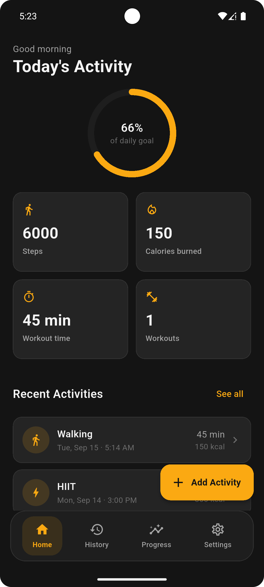
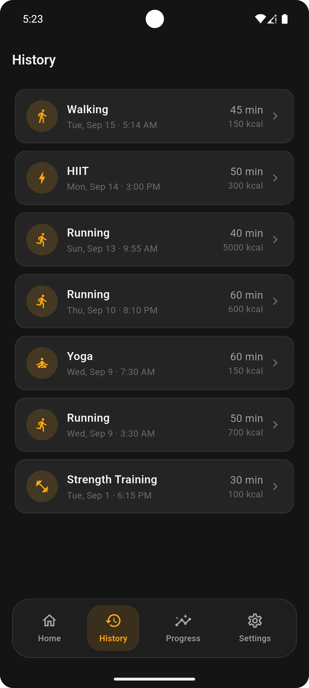
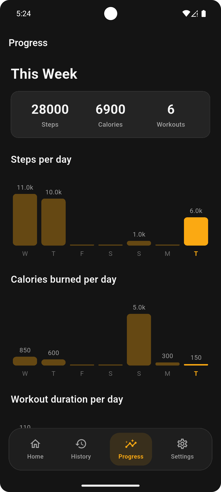
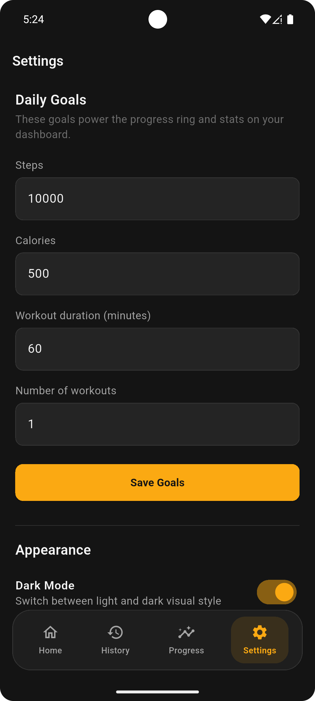
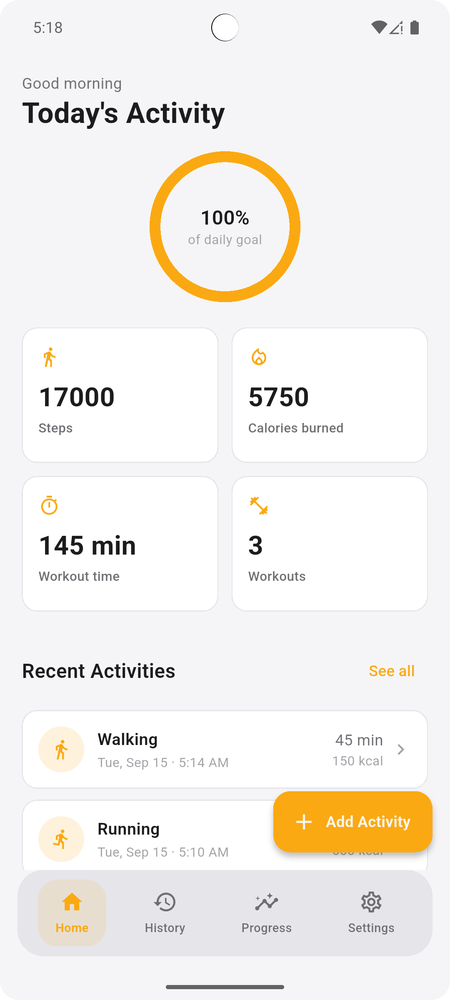
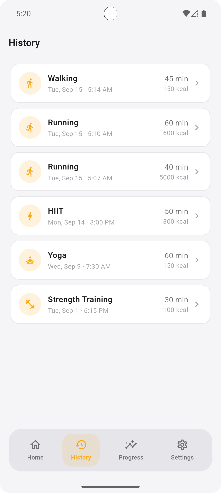
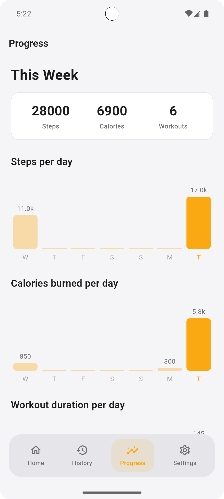
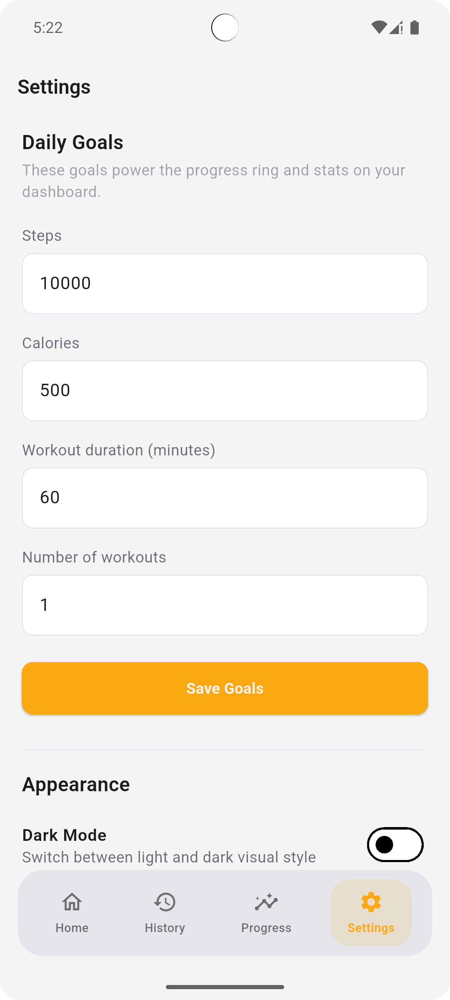

# ✦ LupoFit

A minimal and modern **Fitness Tracker application built with Flutter**.

LupoFit allows users to track their daily physical activities, set personalized fitness goals, monitor their weekly progress, and keep a complete history of their workouts.

The project focuses on a **minimal, clear, and user-friendly experience**, making it easier for users to understand their daily activity and progress without unnecessary complexity.

---

## ✨ Features

### 🏃 Activity Tracking

* Add and record daily fitness activities.
* Track:
  * Workout type
  * Duration
  * Calories burned
  * Steps
  * Date & time
  * Optional notes
* View detailed information about each activity.
* Edit existing activities.
* Delete activities.

### 🎯 Daily Goals

Users can set personalized daily targets for:

* 🔥 Calories burned
* 👣 Steps
* ⏱️ Workout duration
* 🏋️ Number of workouts

The Dashboard uses these targets to calculate the user's overall daily progress.

### 📊 Daily Progress

The Dashboard provides a quick overview of the user's activity for the current day.

It displays:

* Overall daily goal completion
* Today's steps
* Calories burned
* Total workout duration
* Number of workouts
* Recent activities

A visual progress ring provides an easy way to understand how much of the daily goal has been completed.

### 📈 Weekly Progress

The Progress screen provides a summary of the user's activity during the current week.

It includes:

* Total steps
* Total calories burned
* Total workouts
* Steps per day
* Calories burned per day
* Workout duration per day

The weekly statistics help users understand their activity patterns and monitor their consistency.

### 🗓️ Activity History

Activities older than the current progress period remain available in the History screen.

Users can:

* View previous activities
* Open activity details
* Edit activities
* Delete activities
* Review older workout records

This keeps the Progress screen focused on the current week while preserving the complete activity history.

### 🌙 Dark & ☀️ Light Mode

The application supports both:

* Dark Mode
* Light Mode

The theme changes the application's backgrounds, surfaces, text, cards, buttons, and other UI elements to provide a consistent experience in both modes.

### 🧭 Onboarding

* Introduces users to the main features of the application.
* Displays three onboarding screens.
* Onboarding completion is saved locally.
* Returning users can skip onboarding and go directly to the main application.

### ⚡ Splash Screen

* Provides a branded introduction when the application launches.
* Includes a simple animation for the application logo.
* Automatically navigates to the appropriate screen based on whether onboarding has already been completed.

### 🧠 Provider State Management

The application uses **Provider** for state management.

Provider is used to:

* Manage fitness data
* Update the UI when data changes
* Handle loading and error states
* Calculate daily statistics
* Calculate weekly statistics
* Manage user goals
* Refresh activity data

This keeps the UI separated from the application's state and business logic.

### 💾 Local Database

The application uses **SQLite** for local data persistence.

SQLite stores the user's:

* Activities
* Fitness goals
* Activity history

This allows users to keep their fitness data locally without requiring an external backend.

### ✅ Input Validation

Activity data is validated before being stored.

Validation includes:

* Workout type
* Duration
* Calories burned
* Steps

Invalid or unrealistic values are rejected with clear validation messages.

### 📱 Phone-Focused UI

The current version is designed and optimized primarily for **mobile phone screens**.

The interface focuses on:

* Comfortable spacing
* Readable typography
* Touch-friendly controls
* Clear navigation
* Simple information hierarchy

### 🎨 Minimal UI/UX

The application follows a minimal fitness-oriented visual style.

The design focuses on:

* Clear visual hierarchy
* High contrast
* Simple navigation
* Consistent spacing
* Rounded cards
* Focused use of the neon accent color
* Easy-to-understand statistics

Minimalism was also one of the project requirements.

---

## 🖼️ Screenshots

### Onboarding

  
  
  

### 🌙 Dark Mode

  
  
  
  

### ☀️ Light Mode

  
  
  
  

> Place the screenshots inside the `screenshots/` folder using the filenames above.

---

## 🎨 UI/UX Design

The application follows a dark fitness-inspired visual identity built around:

* Deep charcoal backgrounds
* Neon orange accent color
* High-contrast typography
* Rounded cards
* Simple icons
* Clear statistics
* Minimal navigation

The interface was designed to make fitness data easy to scan and understand while keeping the overall experience clean and focused.

---

## 🛠️ Tech Stack

| Technology | Usage |
|---|---|
| **Flutter** | Cross-platform application development |
| **Dart** | Application programming language |
| **Provider** | State management |
| **SQLite** | Local database and data persistence |
| **SharedPreferences** | Local application preferences |
| **Material Design** | UI components and interactions |
| **Figma** | UI/UX design and prototyping |
| **Git & GitHub** | Version control and source management |

### Development Concepts

* State management with Provider
* Local database management
* SQLite CRUD operations
* Data modeling
* Form validation
* Goal-based calculations
* Daily statistics
* Weekly data aggregation
* CRUD operations
* Error handling
* Loading states
* Local persistence
* Theme management
* Dark / Light mode
* Onboarding flow
* Navigation
* Minimal UI/UX design

---

## 🧠 State Management

The application uses **Provider** to manage fitness-related state.

The provider handles:

* Loading activities
* Adding activities
* Updating activities
* Deleting activities
* Loading goals
* Updating goals
* Calculating daily statistics
* Calculating weekly statistics
* Calculating overall goal progress
* Handling database errors

This approach keeps the UI focused on presentation while application logic remains inside the state layer.

---
<h2>💾 Local Data Storage</h2>

  The application uses <strong>SQLite</strong> as its primary local database.

<h3>Activity Model</h3>

Each activity contains:

<pre>
Activity
├── id
├── type
├── durationMinutes
├── caloriesBurned
├── steps
├── dateTime
└── notes
</pre>

<h3>Example</h3>

<pre>
Workout Type: Walking
Duration: 45 minutes
Calories Burned: 150 kcal
Steps: 6000
Date: September 15
Notes: Morning walk
</pre>

  The stored data can later be retrieved, edited, or deleted through the application.

<h2>🎯 Goal Tracking</h2>

  Users can configure their own daily fitness goals.

<h3>Example</h3>

<pre>
Daily Goals

Steps              6000
Calories            500 kcal
Workout Duration    45 min
Workouts            1
</pre>

  The Dashboard compares the user's activity against these targets and calculates
  the overall daily progress.

<h3>Daily Progress Example</h3>

<pre>
66%
of daily goal
</pre>

  This provides a simple visual representation of the user's progress throughout the day.

<h2>📊 Weekly Analytics</h2>

  The application aggregates activity data for the current week.

<h3>Example</h3>

<pre>
This Week

Steps       28000
Calories    6900
Workouts    6
</pre>

Daily charts are used to visualize:

<ul>
  <li>Steps per day</li>
  <li>Calories burned per day</li>
  <li>Workout duration per day</li>
</ul>

  Older activities are still preserved in the History screen.

<h2>🗂️ CRUD Operations</h2>

  The application supports complete activity management:

<pre>
Create
  ↓
Add Activity
  ↓
Read
  ↓
View Dashboard / History
  ↓
Update
  ↓
Edit Activity
  ↓
Delete
  ↓
Remove Activity
</pre>

  This provides users with full control over their locally stored fitness records.

<h2>🧭 App Flow</h2>

<pre>
Splash Screen
      ↓
Onboarding
      ↓
Main Navigation
      ↓
 ┌────────────┬────────────┬────────────┬────────────┐
 │ Dashboard  │  History   │  Progress  │  Settings  │
 └────────────┴────────────┴────────────┴────────────┘
</pre>

<h3>First Launch</h3>

<pre>
Splash
  ↓
Onboarding
  ↓
Get Started
  ↓
Main Navigation
</pre>

<h3>Returning User</h3>

<pre>
Splash
  ↓
Main Navigation
</pre>

  The onboarding state is saved locally using <code>SharedPreferences</code>.

<h2>📐 Current Platform Focus</h2>

  The current version is primarily designed for <strong>mobile phones</strong>.

  The application currently focuses on providing a polished phone experience
  rather than attempting to stretch the same layout across larger screens.

<h3>Future Improvements</h3>

<ul>
  <li>📲 Tablets</li>
  <li>🖥️ Desktop / computer screens</li>
  <li>Adaptive navigation</li>
  <li>Larger-screen layouts</li>
  <li>Multi-column layouts where appropriate</li>
</ul>

<h2>📁 Project Structure</h2>

<pre>
lib/
│
├── core/
│   └── theme/
│       ├── app_colors.dart
│       └── app_text_styles.dart
│
├── models/
│   └── activity.dart
│
├── state/
│   └── fitness_provider.dart
│
├── data/
│   └── database/
│
├── presentation/
│   ├── screens/
│   │   ├── splash_screen.dart
│   │   ├── onboarding_screen.dart
│   │   ├── main_navigation.dart
│   │   ├── dashboard_screen.dart
│   │   ├── history_screen.dart
│   │   ├── progress_screen.dart
│   │   ├── settings_screen.dart
│   │   ├── add_edit_activity_screen.dart
│   │   └── activity_detail_screen.dart
│   │
│   └── widgets/
│       ├── stat_card.dart
│       ├── goal_progress_ring.dart
│       ├── activity_tile.dart
│       ├── section_header.dart
│       └── empty_state.dart
│
└── main.dart

screenshots/
├── splash.png
├── onboarding.png
├── dashboard_dark.png
├── history_dark.png
├── progress_dark.png
├── settings_dark.png
├── activity_details_dark.png
├── dashboard_light.png
├── history_light.png
├── progress_light.png
├── settings_light.png
├── activity_details_light.png
└── activity_add_or_edit_light.png

</pre>

<h2>🚀 Getting Started</h2>

<h3>1. Clone the repository</h3>

<pre>
git clone https://github.com/Haneen-Waleed/codealpha_tasks/tree/task/fitness-tracker-app
</pre>

<h3>2. Navigate to the project</h3>

<pre>
cd fitness_tracker
</pre>

<h3>3. Install dependencies</h3>

<pre>
flutter pub get
</pre>

<h3>4. Run the application</h3>

<pre>
flutter run
</pre>

<h2>🔮 Future Improvements</h2>

<ul>
  <li>Adaptive layouts for tablets</li>
  <li>Desktop / computer layouts</li>
  <li>Workout streak tracking</li>
  <li>More detailed analytics</li>
  <li>More activity types</li>
  <li>Custom workout categories</li>
  <li>Advanced progress insights</li>
  <li>Cloud synchronization</li>
  <li>Backup and restore fitness data</li>
  <li>More customizable goals</li>
</ul>

<h2>🎯 Project Goal</h2>

  The goal of LupoFit is to build a complete Flutter fitness tracking application
  that combines:

<ul>
  <li>Fitness activity tracking</li>
  <li>Local database management</li>
  <li>CRUD operations</li>
  <li>Personalized daily goals</li>
  <li>Daily progress tracking</li>
  <li>Weekly analytics</li>
  <li>Activity history</li>
  <li>State management</li>
  <li>Form validation</li>
  <li>Local persistence</li>
  <li>Dark and Light themes</li>
  <li>User onboarding</li>
  <li>Minimal UI/UX</li>
</ul>

  while maintaining a <strong>simple, clear, and easy-to-use fitness experience</strong>.

<h2>👩‍💻 Author</h2>

  <strong>Haneen Waleed</strong>

  Flutter Developer | Mobile Application Development

  Built as part of the <strong>CodeAlpha App Development Internship</strong>.

