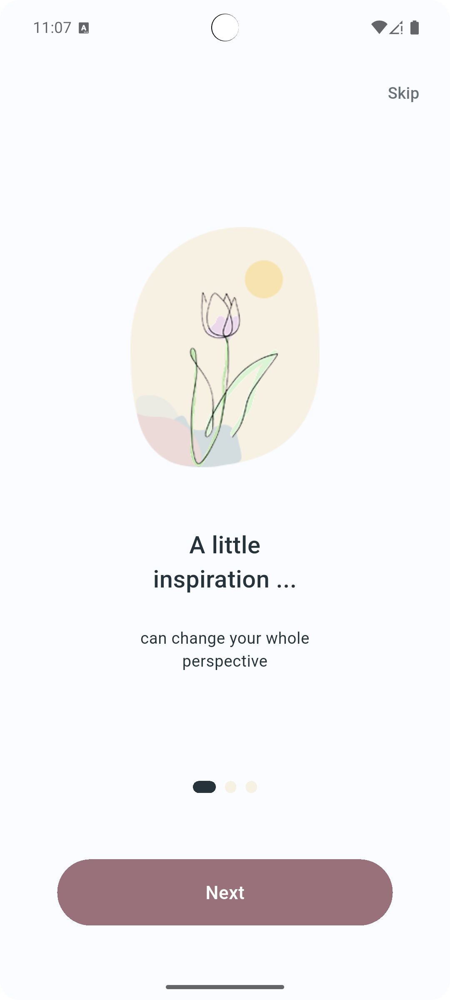
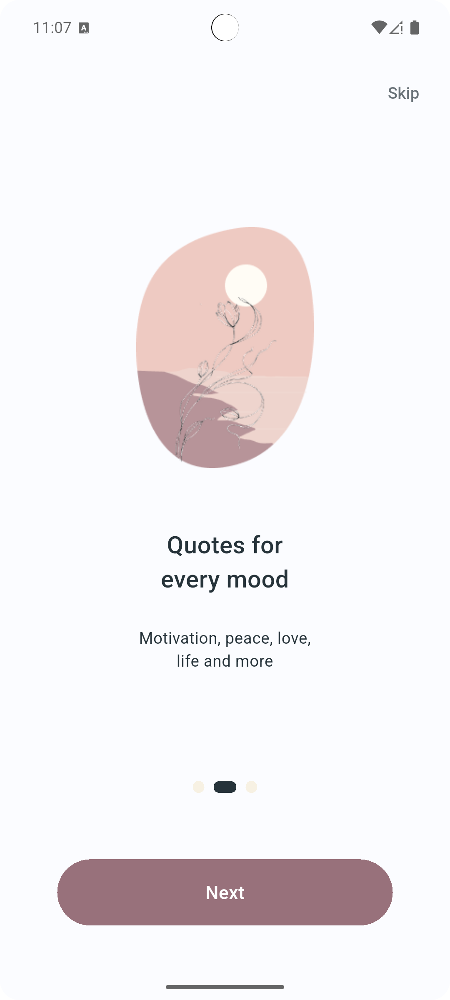
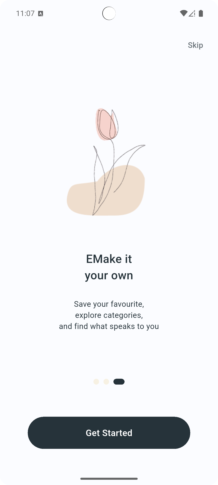
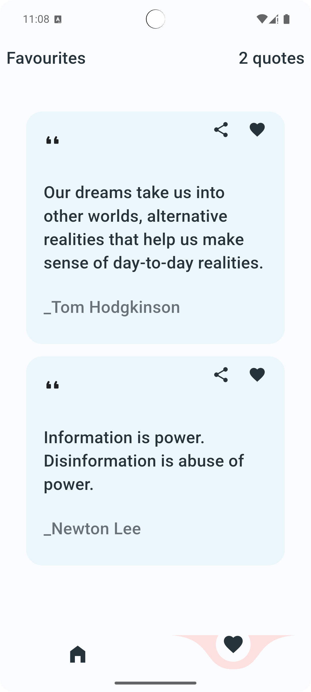

# ✦ Random Quotes

A minimal and elegant **Random Quotes application built with Flutter**.

The app allows users to discover random quotes, save their favourite quotes, search through saved quotes, and share quotes as beautifully generated images.

The project focuses on a **minimal, responsive, and user-friendly experience**, while keeping the architecture organized and easy to maintain.

---

## ✨ Features

### 🎲 Random Quotes

* Fetch random quotes using the **API Ninjas Quotes API**.
* Display quotes and authors in a clean and readable interface.
* Get a new random quote whenever needed.

### 🔄 Pull to Refresh

* Pull down to refresh and fetch a new quote.
* Provides a natural and intuitive way to discover new quotes.

### ❤️ Favourite Quotes

* Add quotes to favourites.
* Remove quotes from favourites.
* Favourites persist between application sessions using `SharedPreferences`.
* Since the API provides quote data but does not manage user-specific favourites, favourites are handled locally.

### 🔎 Search Favourites

* Search through saved favourite quotes.
* Quickly find previously saved quotes.
* Search results update based on the user's input.

### 📤 Share Quotes as Images

* Share quotes directly from the application.
* Quotes are rendered as images before sharing.
* The generated image preserves the visual style of the application.

### 💀 Custom Skeleton Loading

* Custom-built skeleton loading UI while fetching quotes.
* Provides a smoother experience while waiting for API responses.
* Avoids displaying an empty screen or a generic loading indicator.

### ⚠️ Error Handling

* Handles API failures and unexpected responses.
* Provides appropriate feedback when something goes wrong.
* Prevents the application from remaining stuck in a loading state.

### 🧭 Onboarding

* Introduces first-time users to the application.
* Onboarding completion is stored locally.
* Returning users can go directly to the main application.

### 📱 Responsive UI

* Designed to be responsive across different phone screen sizes.
* Uses responsive dimensions to maintain consistent layouts and spacing.

### 📲 Adaptive UI

* The application is being extended to support tablets and larger computer screens.
* The goal is to adapt layouts and content structure for larger screens rather than simply stretching the mobile layout.

### 🎨 Minimal UI/UX

* Clean and minimal visual style.
* Focuses on readability, spacing, and simple navigation.
* Designed to provide an easier and less distracting user experience.
* Minimalism was also one of the project requirements.

### 🧠 Cubit State Management

* Uses **Cubit** to manage application state.
* Separates UI from application logic.
* Handles loading, success, error, favourites, and search states.

---

## 🖼️ Screenshots

### Onboarding

<p align="center">
  
  
  
</p>

### Home & Favourites

<p align="center">
  
  
</p>

> Place the screenshots inside the `screenshots/` folder using the filenames above.

---

## 🎨 UI/UX Design

The application was designed in **Figma** before implementation.

### Figma Design

[View the Random Quotes Figma Design](https://www.figma.com/design/EIUwR7dPiJU89MdM9s6FHh/Random-quotes?node-id=0-1)

The design focuses on:

* Minimal visual hierarchy
* Clear typography
* Comfortable spacing
* Simple navigation
* Easy access to favourites
* Readable quote presentation
* A calm and distraction-free experience

---

## 🛠️ Tech Stack

| Technology               | Usage                                                 |
| ------------------------ | ----------------------------------------------------- |
| **Flutter**              | Cross-platform application development                |
| **Dart**                 | Application programming language                      |
| **Cubit / flutter_bloc** | State management                                      |
| **SharedPreferences**    | Local persistence for favourites and onboarding state |
| **HTTP**                 | REST API communication                                |
| **API Ninjas**           | Random quotes API                                     |
| **Figma**                | UI/UX design and prototyping                          |
| **Git & GitHub**         | Version control and source management                 |

### Development Concepts

* REST API integration
* JSON parsing
* State management with Cubit
* Local data persistence
* Search and filtering
* Error handling
* Loading and skeleton states
* Responsive UI
* Adaptive UI
* Image generation and sharing
* Separation of UI and application logic

---

## 🧠 State Management

The application uses **Cubit** for state management.

Cubit is responsible for handling different application states, including:

* Loading quotes
* Successfully receiving quotes
* API errors
* Adding quotes to favourites
* Removing quotes from favourites
* Loading saved favourites
* Searching through favourites

This keeps the UI separated from the application logic and makes the project easier to maintain and extend.

---

## 💾 Local Data Storage

`SharedPreferences` is used for local persistence.

### Why SharedPreferences?

The Quotes API provides quote data, but favourites are **user-specific data** that need to remain available between application sessions.

Therefore, favourite quotes are stored locally using `SharedPreferences`.

`SharedPreferences` is also used to remember whether the user has completed the onboarding flow.

---

## 🌐 API Integration

The application uses the **API Ninjas Quotes API** to retrieve random quotes.

### API Documentation

[API Ninjas — Quotes API](https://api-ninjas.com/api/quotes)

### Endpoint

```text
https://api.api-ninjas.com/v2/randomquotes
```

The API requires an API key through the `X-Api-Key` request header.

### 🔑 API Key Setup

1. Create a free account on [API Ninjas](https://api-ninjas.com/).
2. Generate your API key.
3. Open:

```text
lib/api_constants.dart
```

4. Add your API key locally.

For example:

```dart
const String apiKey = 'YOUR_API_KEY';
```

### ⚠️ Security

**Never commit your real API key to GitHub.**

The repository should only contain a placeholder value such as:

```dart
const String apiKey = 'YOUR_API_KEY';
```

For a production application, the API key should also be handled using a more secure configuration strategy rather than being exposed directly in the client application.

---

## 📐 Responsive & Adaptive Design

The application is designed with multiple screen sizes in mind.

### 📱 Phones

The current interface is fully focused on providing a responsive experience across different phone screen sizes.

### 📲 Tablets

The layout is being adapted to take advantage of larger tablet screens.

### 🖥️ Computers

The application is also being developed with larger computer screens in mind.

The goal is to provide an appropriate layout for each screen size instead of simply scaling the phone interface.

---

## 📁 Project Structure

```text
lib/
│
├── core/
│   ├── theme/
│   ├── helpers/
│   └── ...
│
├── models/
│   └── quote_model.dart
│
├── api_constants.dart
│
├── features/
│   ├── onboarding/
│   ├── home/
│   ├── favourites/
│   └── ...
│
└── main.dart

screenshots/
├── onboarding_1.png
├── onboarding_2.png
├── onboarding_3.png
├── home.png
└── favourites.png
```

---

## 🚀 Getting Started

### 1. Clone the repository

```bash
git clone https://github.com/Haneen-Waleed/codealpha_tasks.git
```

### 2. Navigate to the project

```bash
cd codealpha_tasks
```

### 3. Switch to the Random Quotes branch

```bash
git checkout task/random-quote-app
```

### 4. Install dependencies

```bash
flutter pub get
```

### 5. Add your API key

Open:

```text
lib/api_constants.dart
```

and add your own API Ninjas API key.

### 6. Run the application

```bash
flutter run
```

---

## 🔗 Project Links

### 💻 GitHub

[View the source code](https://github.com/Haneen-Waleed/codealpha_tasks/tree/task/random-quote-app)

### 🎨 Figma

[View the UI/UX Design](https://www.figma.com/design/EIUwR7dPiJU89MdM9s6FHh/Random-quotes?node-id=0-1)

### 🌐 API

[API Ninjas — Quotes API](https://api-ninjas.com/api/quotes)

---

## 🎯 Project Goal

The goal of this project is to build a complete Flutter application that combines:

* API integration
* JSON parsing
* State management
* Local persistence
* Search functionality
* Image generation and sharing
* Responsive UI
* Adaptive UI
* Error handling
* Skeleton loading
* User onboarding

while maintaining a **minimal interface and an easy user experience**.

---

## 👩‍💻 Author

**Haneen Waleed**

Flutter Developer | Mobile Application Development

Built as part of the **CodeAlpha App Development Internship**.
